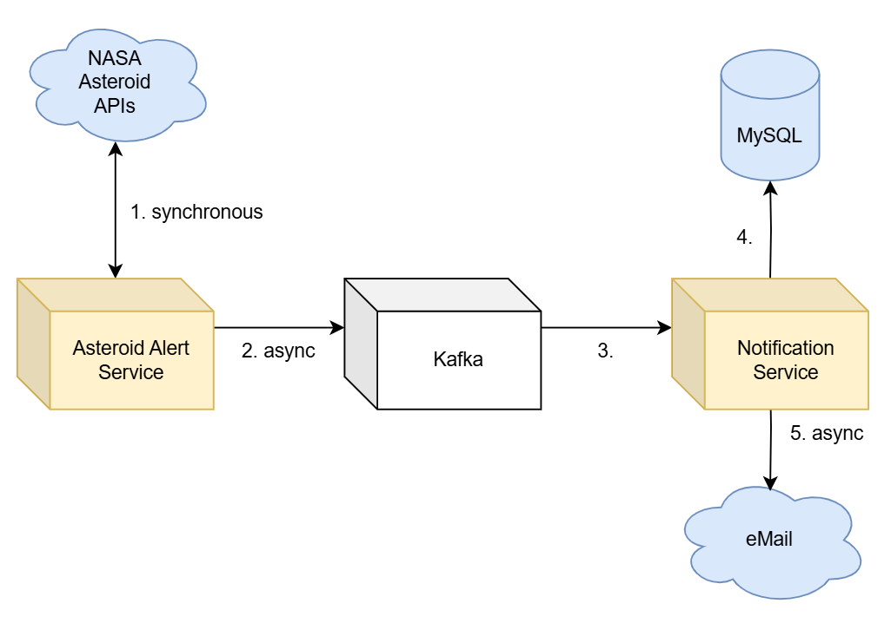
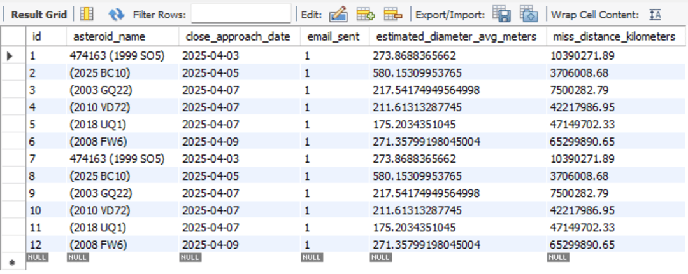

#  OrbitWatch – an Asteroid Collision Notification System

This project is a SpringBoot based notification system that monitors potentially dangerous asteroids approaching Earth and sends email alerts. It utilizes **Kafka, MySQL, Docker, and MailTrap** to handle asynchronous processing and email notifications.  

## System Architecture  

  

The system consists of two microservices:  

1. **Asteroid Alert Service**  
   - Fetches asteroid data from NASA's Asteroids API.  
   - Filters hazardous asteroids and publishes the alerts to a Kafka topic.  

2. **Notification Service**  
   - Consumes Kafka messages.  
   - Stores alert data in MySQL.  
   - Sends email notifications using **MailTrap** (for dev purposes).  

## Technologies Used  

- **SpringBoot**  
- **Kafka** 
- **MySQL**  
- **JPA**  
- **Java Mail Sender** 
- **Docker & Docker Compose**  
- **Postman**
- **MailTrap**

## Project Structure  

The repository contains two separate projects:  

```
Orbit-Watch/
├── asteroid-alert/         # Asteroid Alert Service (Spring Boot)
└── notification-service/   # Notification Service (Spring Boot)
```

**Each project should be opened and run separately**.  

## Getting Started  

### 1. Set Up Docker Containers  

Run the following command inside the ``asteroid-alert`` directory, where the ``docker-compose.yml`` file is located, to start MySQL and Kafka:  

```sh
docker compose -v up -d
```

Verify that the containers are running:  

```sh
docker ps
```

> **Note:** MySQL is configured to run on port 3307. Make sure MySQL Workbench is set up accordingly, using the username and password specified in the Docker Compose file.

After connecting, execute the .sql script located in the ``sql-scripts`` directory to insert user records into the database. These users will receive email notifications, which can be monitored in MailTrap.

### 2. Configure API Keys and MailTrap Credentials  

- In **`asteroid-alert`**, set your **NASA API Key** by replacing the DEMO_KEY in `application.properties`:  

  ```properties
  nasa.neo.api.key=DEMO_KEY
  ```  

- In **`notification-service`**, set your **MailTrap credentials** in `application.properties`:  

  ```properties
  spring.mail.username=your_mailtrap_username
  spring.mail.password=your_mailtrap_password
  ```  

> **Note:** Your MailTrap username and password can be obtained after signing up on the platform. 

### 3. Start the Asteroid Alert Service  

Run the **asteroid-alert** application. Once started, use **Postman** to send a test request:  

```
POST http://localhost:8080/api/asteroid-alert/alert
```

Expected response: **202 Accepted**  

 

This publishes an alert to Kafka's **asteroid-alert** topic.  

### 4. Verify Kafka Message  

You can check the Kafka UI to confirm that the message was published:  

```
http://localhost:8084/ui/clusters/localhost/all-topics/asteroid-alert
```

 

### 5. Start the Notification Service  

Run the **notification-service** application after completing all the steps above.

### 6. Verify MySQL Data  

Use MySQL Workbench to check if the data is correctly stored:  

```sql
SELECT * FROM asteroidalert.notification;
```

  

### 7. Verify Email Notification  

Check **MailTrap** to confirm that the email was sent successfully:  

  


---  

##  License  

This project is licensed under the **MIT License**.  